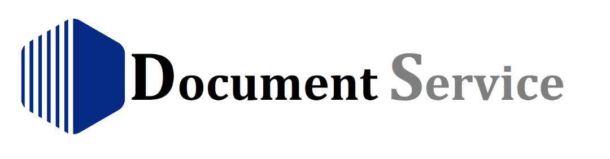
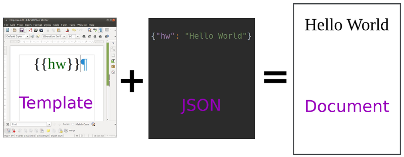
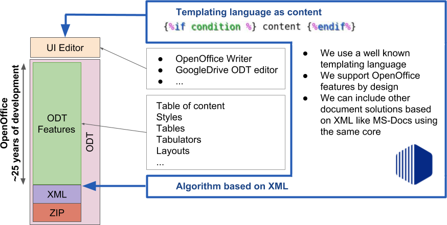
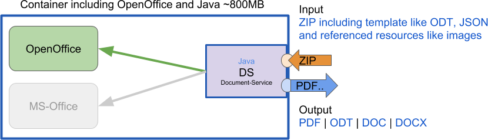

# What is it?
Short explanation:
`Template` + `JSON` = `Document` with the format `PDF`, `ODT`, `DOCX` or `DOC`.



## Technical Overview
The template language is [[jtwig]](https://github.com/jtwig/jtwig-core), it should be a piece of cake for all who are a little bit familiar with `django`, `php-twig` or similar.
The code is directly written as content and can be styled how ever you like, to keep your templates readable.
The `Document-Service` is designed to support any document format based on `XML`. It is using the `XML` fundamentals to separate code from the actual content and to place it meaningful in the `XML` structure. So we can produce the expected document result.



Currently supported template format is `ODT`. Other formats like `DOCX` are not ready yet.

## Install, Build and Run
#### Prerequisites
+ JDK 8
+ gradle
+ docker

Tip: use [sdkman.io](https://sdkman.io/install) for a quick developer setup.

#### Configuration

See [conf.json](src/main/resources/conf.json) and [log4j2.json](src/main/resources/log4j2.json).

#### Building
```
sudo docker build -t document-service .
```

#### Local run for development
```
sudo docker run -p 2115:2115 document-service
```

#### Use the official docker hub image from Proxeus
```
sudo docker run -p 2115:2115 proxeus/document-service:latest
```

## Command line client
You can simply interact with the server using `curl`.


```
# To compile a template to pdf (pdf is the default)

curl --form template=@template.odt --form data=@data.json http://<server>/compile > result.pdf

# To compile a template to odt (available format are pdf, odt, docx or doc)

curl --form template=@template.odt --form data=@data.json http://<server>/compile?format=odt > result.odt

# To embed the template rendering error in the pdf result (add the `error` query parameter

curl --form template=@template.odt --form data=@data.json http://<server>/compile?error > result.pdf

# To get the variables used in a template

curl --data-binary @template.odt http://<server>/vars
curl --form template=@template.odt  http:/<server>/vars

# To get the subset of the variable starting with a given prefix

curl --data-binary @template.odt http://<server>/vars?prefix=foo
curl --form template=@template.odt  http:/<server>/vars?prefix=bar

# To add asset files

curl --form template=@template.odt --form data=@data.json --form asset1=@asset1.png http://<server>/compile > result.pdf

```

## API
The API documentation can be accessed by `<host>:<port>/api` or over the playground UI on the top right corner.

Here a simple overview:



If you are looking for an example implementation of the API please checkout the client source [[here]](client/document_service_client.go).

## License

See the LICENSE file
